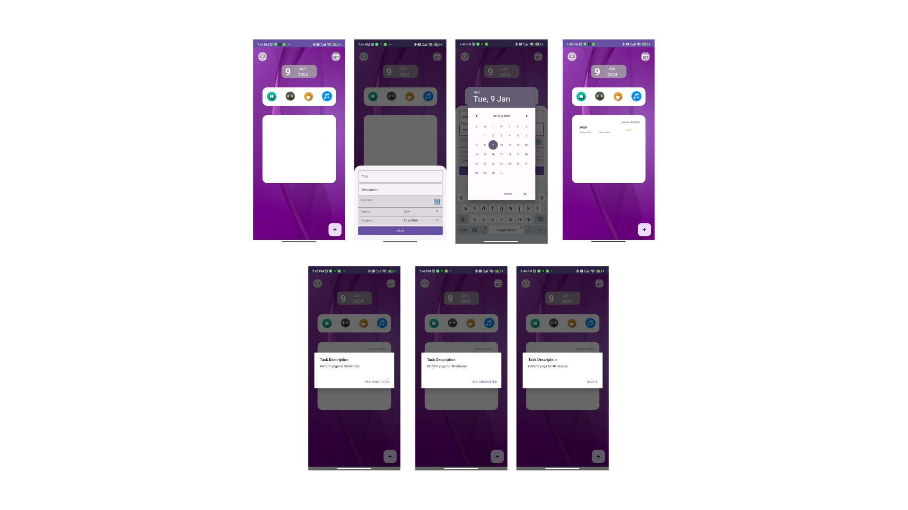

# MyToDoApp



## Overview
My ToDoApp is a simple and eye-catchy to-do list application for Android, It will keep track of your tasks, manage your day, and helps you to stay organized with this easy-to-use app.
App link : https://drive.google.com/file/d/19WFNd8VEYyU6SNgIOvTm7eh42DDxGvj9/view?usp=drive_link
1. Download my app and open.
2. Select on "+" button to add your tasks to the task List Section.
3. Enter the Task Title, Description, Due Date, Priority, Category of the Task.
4. Click on Start button when you are about to start your task.It will show you that the task is in progress.
5. After completion of task, click on "In progress" button, it will show you "Completed Button".
6. Finally, after completing the task, you can delete the task.
7. The Task will be added to the Task List Section and to the local Storage Space.
## Features
• Due Date: Each task should have a due date.

• Priority Levels: Assign priority to tasks as Low, Medium, or High.

• Category: Ability to categorize tasks.

• Task Status: Mark tasks as New, In Progress, or Completed.

• Title and Description: Each task should have a title and a detailed description.

• Local Storage: The app should use local storage to save tasks.
### Prerequisites
- Android Studio
- JDK (Java Development Kit)
### Installation
1.**Clone the repository:**
 ```bash
   git clone https://github.com/Asha2331/TO-DO-LIST.git
2. **Open the project in Android Studio:** 
- Launch Android Studio.
- Create a new project from github url. 
 3. **Set up an emulator or connect a physical device:** 
- If you don't have an emulator set up, follow the instructions in Android Studio to create one. Alternatively, you can connect your Android device via USB and enable USB debugging. 
 4. **Create and run the app:** 
- In Android Studio, click the Run button  (usually a green triangle) or use the Shift + F10 keyboard shortcut.
